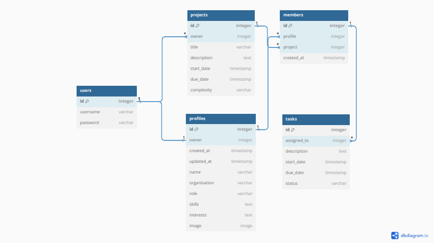

# Smart Work
Smart Work is a project manager app built using the Javascript React framework. The app uses an API created with the Django-Rest Framework to load, create, edit and delete data. The purpose of the site is to collaborate on projects with colleagues or friends, where users can add, update and delete tasks from projects, as well as viewing users profiles and customizing their own. 
## Live Site
[https://smart-work-3d4938feb378.herokuapp.com/](https://smart-work-3d4938feb378.herokuapp.com/)
#### Backend API Site
[https://smart-work-api-c3503744e915.herokuapp.com/](https://smart-work-api-c3503744e915.herokuapp.com)
## Repository
[https://github.com/AlexSmall96/Smart-Work](https://github.com/AlexSmall96/Smart-Work)
#### Backend API Repository
[https://github.com/AlexSmall96/Smart-Work-API](https://github.com/AlexSmall96/Smart-Work-API)
## Author 
Alex Small
## Table of Contents

## Project Goals and Planning

### Database Schema
To plan the structure of the database models, the following diagram was used. 

## UX
### Target Audience
Although Smart Work is a project management app, it is intended to be used by anyone who requires a simple, effective planning and collaboration tool. This could range from professionals working on complex projects, to university students working on group assignments, or even in a more informal setting such as planning a holiday or family chores.
### Site Logic
To plan the flow of logic throughout the site, and the interaction between pages, the following diagram was used.

See [TESTING.MD](https://github.com/AlexSmall96/Smart-Work/blob/main/TESTING.MD) for details of the implementation of this logic.
### Colours
- The main colours used throughout the site are shown in the below diagram. These were chosen to create a professional clean look, yet with enough vibrancy and variety that they create an informal feel, which would appeal to all of the target audience; those who are looking for a sleek design, as well as those intending to use the app for more hobbie or holiday planning. 

- The most widely used colour on the site is the background colour of Middle Blue Green, this choice satisfies the requirements above as well as ensuring the main components such as the project and profile components stand out.

### Fonts

### Images

## React Architecture
Severeal React components were used in the site. The architecture used to build the site using the components is documentated below.
- App is the highest level component, which all other components are nested under.
- Top level components are indicated in orange, level two components are green etc.
- Top level components which have no subcomponents are displayed above the app component in opaque orange.
- Arrow connectors have been used to show the relationship between the components.

## User Stories

## Features

| Feature | Value to User|
|------|------------------|

## Future Features

## Testing
Testing is detailed fully in [TESTING.MD](https://github.com/AlexSmall96/Smart-Work/blob/main/TESTING.MD).

## Programming Languages, Frameworks, and Libraries used

## Other programs used
- [https://dbdiagram.io/home](dbdiagram) was used to create the database schema diagram.
- [https://www.figma.com](Figma) was used to create site logic and react architecture
diagrams.
- Am i responsive
- Colour pallete
- Github
- Gitpod
-

# Deployment
### Deploying the Site to Heroku
1. On Heroku.com, click Create New App.
2. Select the appropriate region and choose a relevant name.
3. Once the app is created, click on it in the dashboard and go to the deploy tab.
4. Go to deployment methods, select GitHub.
5. Search for the name of the repository and click connect.
6. Go to the Manul Deploy section and click deploy main branch.
7. Wait for the build log to complete and click View App so view site.
### Forking the Repository on GitHub
1. On GitHub.com, navigate to the main page of the repository.
2. In the top-right corner of the page, click Fork.
3. Select an owner for the forked repository.
4. By default, forks are named the same as their upstream repositories. You can change the name of the fork to distinguish it further.
5. Optionally, add a description of your fork.
6. Choose whether to copy only the default branch or all branches to the new fork. For many forking scenarios, such as contributing to open-source projects, you only need to copy the default branch. By default, only the default branch is copied.
7. Click Create Fork.
### Cloning the Repository on GitHub
1. On GitHub.com, navigate to the main page of the repository.
2. Above the list of files, click Code.
3. Copy the URL for the repository.
4. Open Terminal.
5. Change the current working directory to the location where you want the cloned directory.
6. Type git clone, and then paste the URL you copied earlier.
7. Press Enter to create your local clone.

# Credits
## Content

## Media

## Code
https://stackoverflow.com/questions/43875517/react-bootstrap-remove-active-after-button-was-clicked
https://stackoverflow.com/questions/67866155/how-to-handle-onchange-value-in-date-reactjs

## Acknowledgements 
This application was created as a portfolio 5 project for the Diploma in Full Stack Software Development from [Code Institute](https://codeinstitute.net/full-stack-software-development-diploma/?utm_term=code%20institute&utm_campaign=CI+-+UK+-+Search+-+Brand&utm_source=adwords&utm_medium=ppc&hsa_acc=8983321581&hsa_cam=1578649861&hsa_grp=62188641240&hsa_ad=635720257674&hsa_src=g&hsa_tgt=kwd-319867646331&hsa_kw=code%20institute&hsa_mt=e&hsa_net=adwords&hsa_ver=3&gclid=CjwKCAiA5Y6eBhAbEiwA_2ZWIUE0LRewvfAYnQS69Lujb5s2FrQjmX0Idzqj-Olbamn1DbS2D-R7gBoC-1AQAvD_BwE
)
I would like to thank my mentor mentor_name for his/her encouraging support and detailed feedback throughout this project.