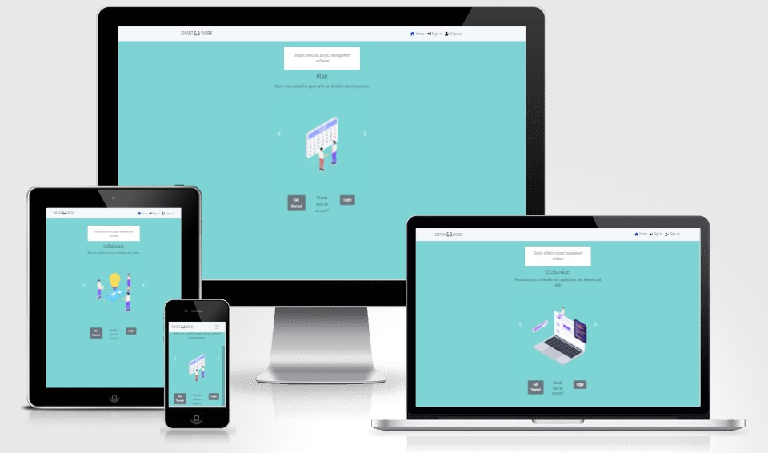
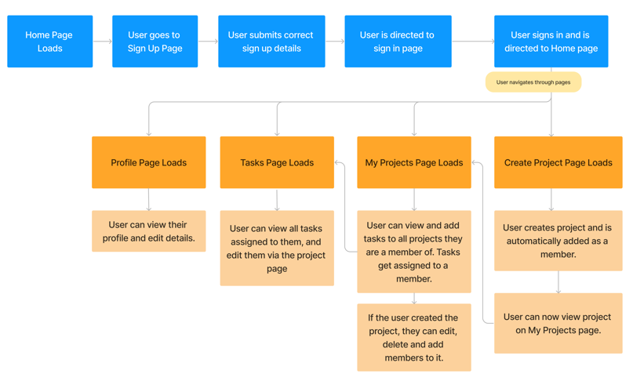
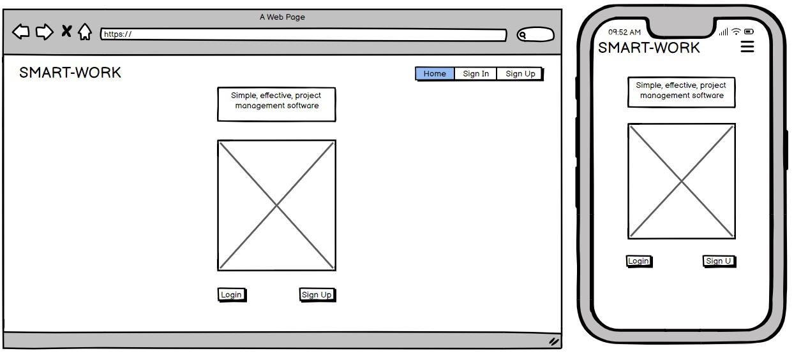
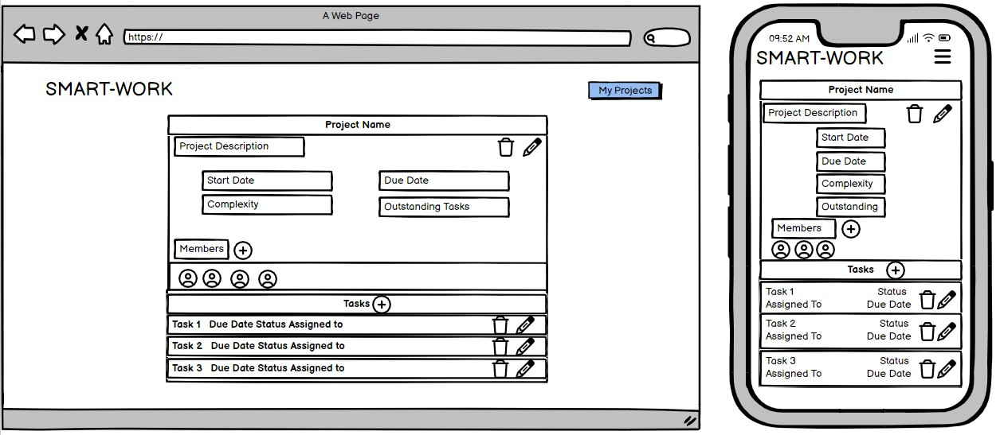
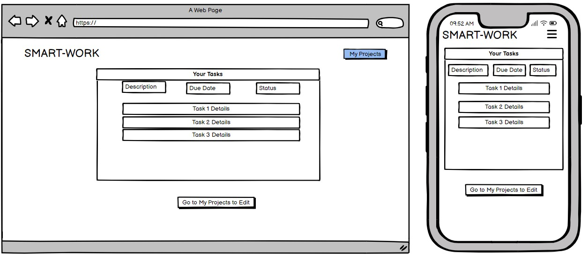
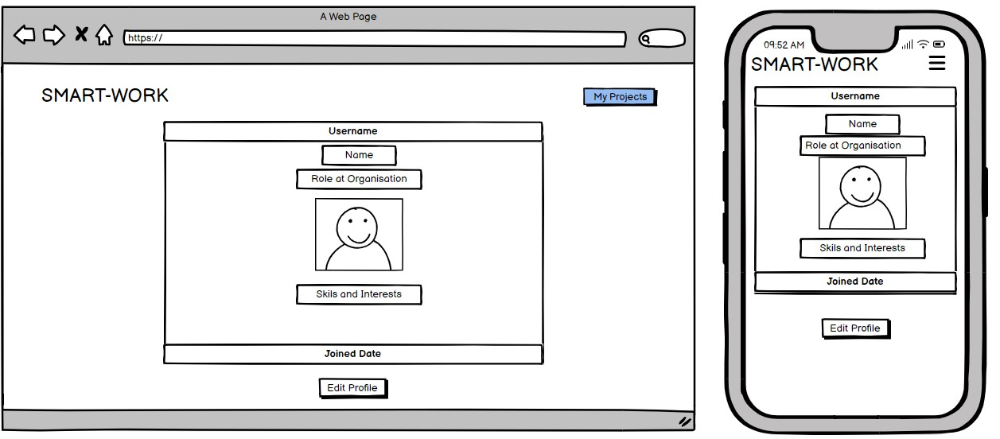
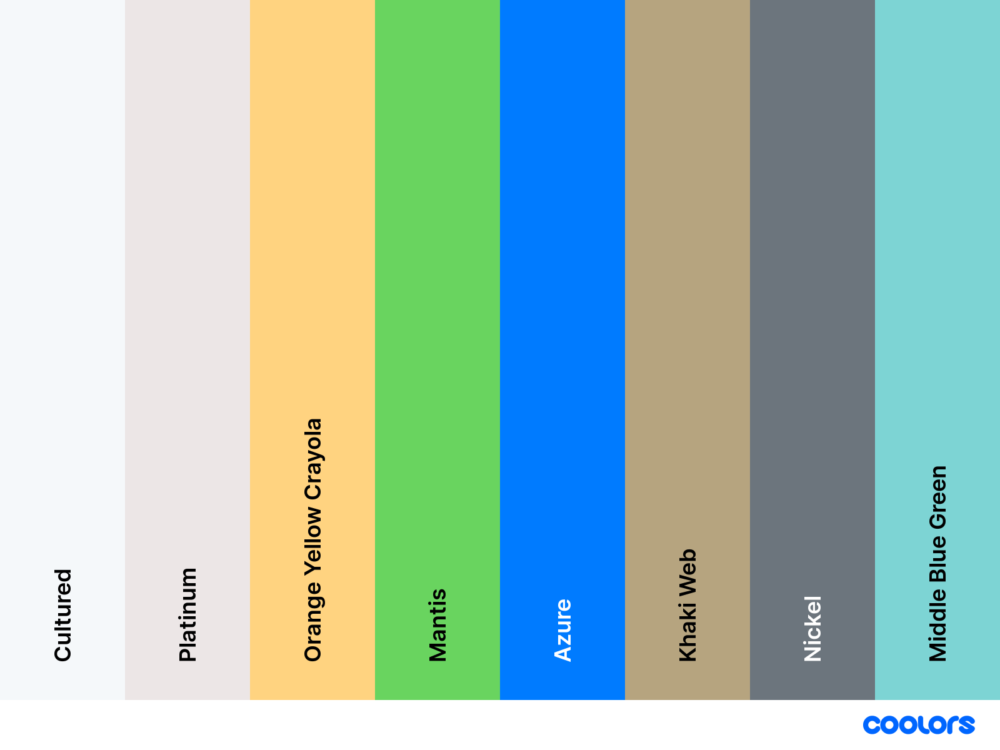
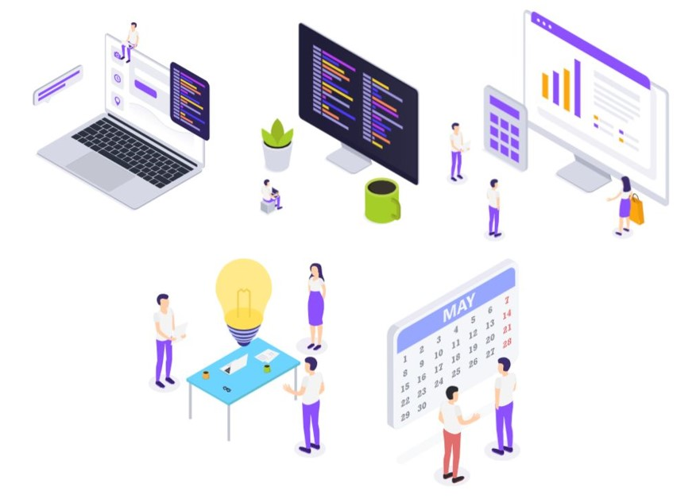
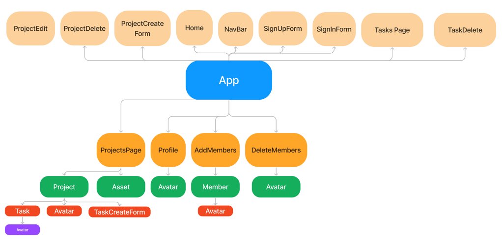

# Smart Work
Smart Work is a project manager app built using the Javascript React framework. The app uses an API created with the Django-Rest Framework to load, create, edit, and delete data. The purpose of the site is to collaborate on projects with colleagues or friends, where users can add, update and delete tasks from projects, as well as view users' profiles and customize their own. The app is split into two seperate sites. This repository is the front end JS React section of the app.

 
## Live Site
[https://smart-work-3d4938feb378.herokuapp.com/](https://smart-work-3d4938feb378.herokuapp.com/)
#### Backend API Site
[https://smart-work-api-c3503744e915.herokuapp.com/](https://smart-work-api-c3503744e915.herokuapp.com)
## Repository
[https://github.com/AlexSmall96/Smart-Work](https://github.com/AlexSmall96/Smart-Work)
#### Backend API Repository
[https://github.com/AlexSmall96/Smart-Work-API](https://github.com/AlexSmall96/Smart-Work-API)
## Author 
Alex Small
## Table of Contents
- [Smart Work](#smart-work)
  * [Live Site](#live-site)
      - [Backend API Site](#backend-api-site)
  * [Repository](#repository)
      - [Backend API Repository](#backend-api-repository)
  * [Author](#author)
  * [Table of Contents](#table-of-contents)
  * [Project Goals and Planning](#project-goals-and-planning)
  * [UX](#ux)
    + [Target Audience](#target-audience)
    + [Site Logic](#site-logic)
    + [Wireframes](#wireframes)
      - [Home Page](#home-page)
      - [Projects Page](#projects-page)
      - [Tasks Page](#tasks-page)
      - [Profile Page](#profile-page)
    + [Colours](#colours)
    + [Fonts](#fonts)
    + [Images](#images)
  * [React Architecture](#react-architecture)
    + [Reuse of Components](#reuse-of-components)
  * [User Stories](#user-stories)
    + [Create a modern, professional-looking project manager app](#create-a-modern--professional-looking-project-manager-app)
    + [Create a simple effective planning system to help meet deadlines](#create-a-simple-effective-planning-system-to-help-meet-deadlines)
    + [Allow users to customize their profile, and view others](#allow-users-to-customize-their-profile--and-view-others)
  * [Testing](#testing)
  * [Programming Languages, Frameworks, and Libraries used](#programming-languages--frameworks--and-libraries-used)
  * [Other programs used](#other-programs-used)
- [Deployment](#deployment)
    + [Deploying the Site to Heroku](#deploying-the-site-to-heroku)
    + [Forking the Repository on GitHub](#forking-the-repository-on-github)
    + [Cloning the Repository on GitHub](#cloning-the-repository-on-github)
- [Credits](#credits)
  * [Content](#content)
  * [Media](#media)
  * [Code](#code)
  * [Acknowledgements](#acknowledgements)
## Project Goals and Planning
The goals of the project are as follows:

- Create a modern, professional-looking project manager app
- Allow users to easily navigate throughout the site
- Allow users to collaborate on projects and tasks
- Create a simple effective planning system to help meet deadlines
- Allow users to customize their profile, and view others

## UX
### Target Audience
Although Smart Work is a project management app, it is intended to be used by anyone who requires a simple, effective planning and collaboration tool. This could range from professionals working on complex projects to university students working on group assignments, or even in a more informal setting such as planning a holiday or family chores.
### Site Logic
To plan the flow of logic throughout the site, and the interaction between pages, the following diagram was used.

See [TESTING.MD](https://github.com/AlexSmall96/Smart-Work/blob/main/TESTING.MD) for details of the implementation of this logic.

### Wireframes

To plan the basic layout of each page, the below diagrams were created. A wireframe for each page has been provided, on desktop and mobile.
#### Home Page

#### Projects Page

#### Tasks Page

#### Profile Page

### Colours
- The main colors used throughout the site are shown in the below diagram. These were chosen to create a professional clean look, yet with enough vibrancy and variety that they create an informal feel, which would appeal to all of the target audience; those who are looking for a sleek design, as well as those intending to use the app for more hobbies or holiday planning. 

- The most widely used color on the site is the background color of Middle Blue Green, this choice satisfies the requirements above as well as ensures the main components such as the project and profile components stand out.

### Fonts
The font used on the site is Fira Sans Extra Condensed from google fonts. This was chosen again to appeal to the target audience as it has a professional clean look with an informal edge.
### Images
The images chosen were modern cartoon-style images of work situations. This fits well with the theme of the project, as creates ideas of organized workflow and optimized work environments, something Smart Work can help to achieve.

## React Architecture
Several React components were used in the site. The architecture used to build the site using the components is documented below.
- App is the highest level component, which all other components are nested under.
- Top-level components are indicated in orange, level two components are green, etc.
- Top-level components which have no subcomponents are displayed above the app component in opaque orange.
- Arrow connectors have been used to show the relationship between the components.

### Reuse of Components
Below is a summary of the react components which are used multiple times in their corresponding parent component (See above diagram). For each component, its purpose and parent is given. 

| Component    | Purpose     | Parent Component | Use in Parent Component
| -----------  | ----------- |-----------------|-----------------|
|Project|Loads the individual project data along with its members|Projects Page|Each project the user is currently a member of is represented by a project component. 
|Task|Loads the individual task data|Project|Each project component has a list of associated tasks, which are represented by the task components.
|Avatar|Displays the users profile image with added style and optional text with their username|Project|The projects members are displayed in a list, each represented by the avatar component.
|Member|A button element with the users profile image, name and organisation, to add or remove a member to a project.|AddMembers|The AddMembers component contains a list of all users, each represented by a Member component. 
|Avatar|Displays the users profile image with added style and optional text with their username|DeleteMembers|The DeleteMembers component contains a list of all users with the option to remove them from the project, each represented by an Avatar component.

## User Stories
- User stories were linked to issues on GitHub (see the above link to view the repository). This was used as an agile tool to help plan and develop the project.
- Below is the full list of user stories, divided by project goals. 
- See [TESTING.MD](https://github.com/AlexSmall96/Smart-Work/blob/main/TESTING.MD) for details of the acceptance criteria for each user story.

### Create a modern, professional-looking project manager app
  - As a User, I would like to be taken to a home page upon sign-in, where it is clear what the function and purpose of the site are.
  - As a User, I would like to quickly tell which tab corresponds to Smart Work when I have multiple tabs open.
- Allow users to easily navigate throughout the site
  - As a User, I can view a navbar on every page of the site, and easily navigate to any other accessible page.
- Allow users to collaborate on projects and tasks
   - As a User, I can create a new project and add members to it.
   - As a User, I can select a project I am a member of and view its details.
   - As a user, I would like to edit the details of the projects that I created or delete them.
### Create a simple effective planning system to help meet deadlines
  - As a user, I would like to add tasks to my projects and update them based on their due date and status.
  - As a user, I would like to delete a task that I added to a project if I no longer feel it is appropriate.
### Allow users to customize their profile, and view others
  - As a User, I can register an account so I can access all the features available to signed-up users.
  - As a user, I would like to view my profile and add personal details such as a profile image, interests, and skills.
  - As a user, I can click on a user's profile image when displayed on relevant pages, and I am taken to their profile page.

## Testing
Testing is detailed fully in [TESTING.MD](https://github.com/AlexSmall96/Smart-Work/blob/main/TESTING.MD).

## Programming Languages, Frameworks, and Libraries used
- The frontend site was built using the Javascript React Framework, along with CSS.
- To aid in component functionality and styling, React-Bootstrap was used.
- React Router Dom was used to link all the components to a path.
- Axios were used to aid in API requests
- jwt-decode was used to remove and refresh access tokens
- The JS library date-fns was used to aid in formatting dates for project and task creation and updating.
## Other programs used
- [https://cloudinary.com/](Cloudinary) was used to store the site images.

- [https://www.figma.com](Figma) was used to create site logic and react architecture
diagrams.
- [http://amiresponsive.blogspot.com/](Colours.co) Am I responsive was used to create a responsive diagram.
- [https://coolors.co/](Colours.co) was used to create the colour pallet diagram
- Github was used as a version control system.
- Gitpod was used as a development environment.

# Deployment
### Deploying the Site to Heroku
1. On Heroku.com, click Create New App.
2. Select the appropriate region and choose a relevant name.
3. Once the app is created, click on it in the dashboard and go to the deploy tab.
4. Go to deployment methods, and select GitHub.
5. Search for the name of the repository and click connect.
6. Go to the Manual Deploy section and click deploy main branch.
7. Wait for the build log to complete and click View App to view the site.
### Forking the Repository on GitHub
1. On GitHub.com, navigate to the main page of the repository.
2. In the top-right corner of the page, click Fork.
3. Select an owner for the forked repository.
4. By default, forks are named the same as their upstream repositories. You can change the name of the fork to distinguish it further.
5. Optionally, add a description of your fork.
6. Choose whether to copy only the default branch or all branches to the new fork. For many forking scenarios, such as contributing to open-source projects, you only need to copy the default branch. By default, only the default branch is copied.
7. Click Create Fork.
### Cloning the Repository on GitHub
1. On GitHub.com, navigate to the main page of the repository.
2. Above the list of files, click Code.
3. Copy the URL for the repository.
4. Open Terminal.
5. Change the current working directory to the location where you want the cloned directory.
6. Type git clone, and then paste the URL you copied earlier.
7. Press Enter to create your local clone.

# Credits
## Content
The site was built with inspiration from the Code Institute Moments walkthrough project. Several components have been created with the walkthrough project as source material, however, custom code was required to deal with deviations in the site functionality and database schema.
## Media
The images used on the home page and sign up / sign up pages were taken from 
[https://pixelied.com/home](pixelid)
## Code
Several external resources were used in the code. The links to the resources are given below, along with the file and line they were used at.

- Member.Module.css, line 6: The code used to remove the active display after a button is clicked was taken from [https://stackoverflow.com/questions/43875517/react-bootstrap-remove-active-after-button-was-clicked]().
- TaskCreateForm.js, line 48, Task.js, line 46, Task.js, line 46, ProjectCreateForm.js, line 31, ProjectEdit.js, line 47 : The code to handle data formatting was taken from
[https://stackoverflow.com/questions/67866155/how-to-handle-onchange-value-in-date-reactjs]().
## Acknowledgements 
This application was created as a portfolio 5 project for the Diploma in Full Stack Software Development from [Code Institute](https://codeinstitute.net/full-stack-software-development-diploma/?utm_term=code%20institute&utm_campaign=CI+-+UK+-+Search+-+Brand&utm_source=adwords&utm_medium=ppc&hsa_acc=8983321581&hsa_cam=1578649861&hsa_grp=62188641240&hsa_ad=635720257674&hsa_src=g&hsa_tgt=kwd-319867646331&hsa_kw=code%20institute&hsa_mt=e&hsa_net=adwords&hsa_ver=3&gclid=CjwKCAiA5Y6eBhAbEiwA_2ZWIUE0LRewvfAYnQS69Lujb5s2FrQjmX0Idzqj-Olbamn1DbS2D-R7gBoC-1AQAvD_BwE
)
I would like to thank my mentor [Gareth McGirr](https://github.com/Gareth-McGirr ) for his encouraging support and detailed feedback throughout this project. I would also like to thank the tutor support team for their helpful advice.

