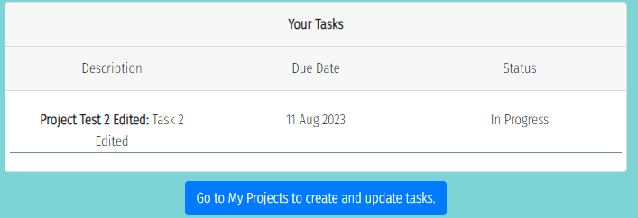

# Testing

## Table of Contents

## Manual Testing
This section has been divided into subsections based on each page of the site. For each subsection, a table is given with the list of tests required, showing its category, description, and a pass/fail status. Each test has a unique reference number. Where applicable, screenshots are given of evidence of passing the test, with each image referencing the test by its number.
### Home Page
| Test No.    | Category    | Pass Criteria | Pass/Fail |
| ----------- | ----------- |---------------|-----------|
| 1.1         | Loading Data| Cover Text box loads with text displaying correctly|Pass
| 1.2         | Loading Data| Carousel images load correctly with corresponding caption above |Pass
| 1.3         | Loading Data| Carousel cycles through images automatically and when clicked |Pass
| 1.4         | Loading Data| Carousel cycles through images automatically and when clicked |Pass
| 1.5         | Loading Data| Home page loads with get started and login buttons appearing below images |Pass
| 1.6         | Component Interactivity | Hovering over Get Started button or login in button makes them darker |Pass
| 1.7         | Site Navigation| Clicking Get Started Button loads sign up page |Pass
| 1.8         | Site Navigation| Clicking Log in Button loads sign in page |Pass    
| 1.9         | Site Navigation| Clicking sign out successfully signs the user out and appropriate icons appear in navbar 
[Home Page Tests Screenshots](https://github.com/AlexSmall96/Smart-Work/blob/main/documentation/testing/HomePage.pdf)

### Navigation Bar
| Test No.    | Category    | Pass Criteria | Pass/Fail |
| ----------- | ----------- |---------------|-----------|
|2.1          |Loading Data |Logo loads in top left corner| Pass
|2.2          |Loading Data |When user isn't logged in, the home, signup and signin icons appear| Pass
|2.3          |Loading Data |When user is logged in, the home, my projects, my tasks, sign out and profile icons appear, with the new project icon appearing next to the logo| Pass
|2.4          |Component Interactivity |When the icons are hovered over, they turn blue| Pass
|2.5          |Site Navigation |All the links in the nav bar take the user to the correct page| Pass
|2.6          |Component Interactivity |The icon corresponding to the current page stays blue| Pass

[Navigation Bar Tests Screenshots](https://github.com/AlexSmall96/Smart-Work/blob/main/documentation/testing/NavBar.pdf)

### Signin Page
| Test No.    | Category    | Pass Criteria | Pass/Fail |
| ----------- | ----------- |---------------|-----------|
|3.1          |Loading Data |Form loads with sign in button below| Pass
|3.2          |Loading Data |Button with sign up link appears below form| Pass
|3.3          |Loading Data |Image appears next to form on screens >768px in width| Pass
|3.4          |Site Navigation |Sign up button takes user to sign up page| Pass
|3.5          |Input Validation |Submitting the form with username blank gives an error message stating 'Must include "username" and "password"| Pass
|3.6          |Input Validation |Submitting the form with password blank gives an error message stating 'This field may not be blank'| Pass
|3.7          |Input Validation |Submitting the form with incorrect login details gives an error message stating 'Unable to login in with provided credentials' | Pass
|3.8          |Input Validation |Submitting the form with correct login details directs the user to the home page | Pass

[SignIn Page Tests Screenshots](https://github.com/AlexSmall96/Smart-Work/blob/main/documentation/testing/SignIn.pdf)

### Signup Page
| Test No.    | Category    | Pass Criteria | Pass/Fail |
| ----------- | ----------- |---------------|-----------|
|4.1          |Loading Data |Form loads with sign up button below| Pass
|4.2          |Loading Data |Button with sign in link appears below form| Pass
|4.3          |Loading Data |Image appears next to form on screens >768px in width| Pass
|4.4          |Site Navigation |Sign in button takes user to sign in page| Pass
|4.5          |Input Validation |Submitting the form with username or password blank gives an error message stating 'This field may not be blank| Pass
|4.6          |Input Validation |Submitting the form with an insecure password gives messages stating it is not secure enough (too short, too common, entirly numeric)| Pass
|4.7          |Input Validation |Submitting the form with the two password fields not matching gives error message stating the problem| Pass
|4.8          |Input Validation |Submitting the form with an already taken username gives error message stating the problem| Pass
|4.9          |Input Validation |Submitting successful sign up details directs the user to the sign in page| Pass

[Signup Page Tests Screenshots](https://github.com/AlexSmall96/Smart-Work/blob/main/documentation/testing/SignUp.pdf)

### Profile Page
| Test No.    | Category    | Pass Criteria | Pass/Fail |
| ----------- | ----------- |---------------|-----------|
|5.1          |Loading Data |When new profile is created, profile page loads with username, default image, and date joined| Pass
|5.2           |Loading Data |If the user is viewing their own profile, edit profile button appears below below profile card, with stats at the bottom of page| Pass
|5.3           |Loading Data |If the user is viewing another users profile, go back button appears below below profile card, with stats at the bottom of page| Pass
|5.4           |Site Navigation |Clicking edit profile button takes user to form with profile details, with save changes button and go back button appearing below| Pass
|5.5           |Site Navigation |Clicking go back button takes user to previously visited page| Pass
|5.6           |Loading Data |Each field can be edited with any text value and chosen value stays in input field| Pass
|5.7           |Loading Data |User can upload a new profile image by clicking 'Click to upload image' and new image is displayed in form | Pass
|5.8           |Input Validation |Any chosen information can be submitted, once form is submitted user is redirected back to profile page and new information is shown | Pass
|5.9           |Loading Data |Correct numbers appear in stats section | Pass

[Profile Page Tests Screenshots](https://github.com/AlexSmall96/Smart-Work/blob/main/documentation/testing/ProfilePage.pdf)

### Project Create Page
| Test No.    | Category    | Pass Criteria | Pass/Fail |
| ----------- | ----------- |---------------|-----------|
|6.1          |Loading Data |Form loads with text fields blank, dates set to todays date and complexity set to low| Pass
|6.2          |Loading Data |Cancel and create project buttons appear below form| Pass
|6.3          |Site Navigation|Cancel button takes user back to previous page| Pass 
|6.5          |Input Validation|Submitting the form with title field blank gives an error   | Pass 
|6.6          |Input Validation|Trying to change the start date to a date iin the past gives an error  | Pass
|6.7          |Input Validation|Trying to change the due date to a date before the start date gives an error  | Pass
|6.8          |Input Validation|Any value can be inputted into text fields, complexity can be changed to any value | Pass
|6.9          |Site Navigation|Submitting the form with correct data directs the user to the projects page and new project appears | Pass

[Create Project Page Tests Screenshots](https://github.com/AlexSmall96/Smart-Work/blob/main/documentation/testing/CreateProjectPage.pdf)
### Projects Page
This section is divided into further subsections based on which data model is being tests: projects, members or tasks.
#### Projects
| Test No.    | Category    | Pass Criteria | Pass/Fail |
| ----------- | ----------- |---------------|-----------|
|7.1          |Loading Data | Projects created by the user appear in projects page, with users profile image in top right corner of the project component        | Pass
|7.2         |Loading Data | Projects created by other users that the current user is a member of appear in projects page, with the project owner image appearing in the top right corner of the project component | Pass
|7.3         |Component Interactivity | Clicking view details on each project component expands the body, showing its data, members and tasks | Pass
|7.4         |Loading Data | All the current members of the project appear in the members list, displayed by thier profile images | Pass
|7.5         |Loading Data | If the current user is the owner of the project, edit and delete buttons appear at the top of the comonent, and add and delete buttons appear above members list | Pass
|7.6         |Component Interactivity |Clicking the edit project button directs the user to a form on a seperate page, showing project details | Pass
|7.7         |Input validation |The title field cannot be changed to blank | Pass
|7.8         |Input Validation|Trying to change the start date to a date iin the past gives an error  | Pass
|7.9              |Input Validation|Trying to change the due date to a date before the start date gives an error  | Pass
|7.10                 |Input Validation|Submitting the form with correct information gives a message stating 'Project Details Updated' and save changes button dissapears  | Pass
|7.11                 |Site navigation|Before form is submitted, clicking go back button takes user back to the projects page | Pass
|7.12 |Component interactivity               |Clicking the delete project button directs the user to a seperate page with message stating 'Are you sure you want to delete project' with project name appearing in message | Pass
|7.12|Site navigation                 |Clicking the delete project button directs the user to a seperate page with message stating 'Are you sure you want to delete project' with project name appearing in message, and yes and no buttons appearing below | Pass
|7.13|Site navigation                 |Clicking no redirects the user to projects page, clicking yes makes message appear stating 'Project deleted' with back to projects button appearing below | Pass
|7.14|Site navigation                 |Clicking back to projects button redirects user to projecs page, with deleted project now gone | Pass
#### Members
| Test No.    | Category    | Pass Criteria | Pass/Fail |
| ----------- | ----------- |---------------|-----------|
|7.15|Component Interactivity |Clicking add members button directs the user to a seperate page with list of members | Pass
|7.16|Component Interactivity |Searching by username in the top search bar filters the results appropriately | Pass
|7.17|Loading Data |Existing members of the project cannot be selected| Pass
|7.18|Component Interactivity |Clicking on a members button creates a tick mark next to thier name, highlights their box in blue and their name appears at bottom of card| Pass
|7.19|Component Interactivity |Clicking on users name at bottom of card removes them from footer and removes tick box in body| Pass
|7.20|Form Handling|Clicking add users to project results in a message stating 'Members added to project' and add users button disspears| Pass
|7.21|Site Navigation|Clicking delete members button takes the user to a seperate page, with all the members of the project appearing with a delete button next to their name | Pass
|7.22|Component Interactivity|Clicking one of the delete buttons makes are you sure message appear at bottom of card, with users name | Pass
|7.23|Site Navigation|Clicking No takes the user back to the projects page | Pass
|7.24|Site Navigation|Clicking yes results in a confirmation message, and deleted member is now gone from list, with back to projects button appearing | Pass
|7.25|Site Navigation|Clicking back to projects takes user back to projects page, and delted member is now gone from members list in project component | Pass
#### Tasks
| Test No.    | Category    | Pass Criteria | Pass/Fail |
| ----------- | ----------- |---------------|-----------|
|7.26|Component Interactivity|Clicking the add tasks button reveals a form below, with the add tasks button being replaced with 'Hide Form' | Pass 
|7.27|Input Validation|Submitting the form with description field blank gives an error|Pass
|7.28         |Input Validation|Trying to change the start date to a date iin the past gives an error  | Pass
|7.29              |Input Validation|Trying to change the due date to a date before the start date gives an error  | Pass
|7.30              |Input Validation|All members of the project apppear in dropdown for 'Assigned to' field and any can be selected | Pass
|7.31                 |Form Handling|Submitting the form with correct data results in 'Task Created Successfully' message appearing, with create new task button below | Pass  
|7.32                 |Loading Data|When task is created it appears at bottom of project component | Pass 
|7.33                 |Loading Data|If the current user is assigned to the task, they can see edit and delete buttons | Pass
|7.34                 |Component Interactivity|Clicking the edit task button reveals a form below, with edit task button replaced with 'hide' | Pass
|7.35|Input Validation|Submitting the form with description field blank gives an error|Pass
|7.36         |Input Validation|Trying to change the start date to a date iin the past gives an error  | Pass
|7.37              |Input Validation|Trying to change the due date to a date before the start date gives an error  | Pass
|7.38              |Input Validation|Submitting a form with correct data shows 'Task updated successfully' message, with 'Update more details' button appearing.  | Pass
|7.39              |Loading Data|New Task details appear in task list  | Pass
|7.40              |Loading Data|Updating a tasks status to In Progress colours it amber, updating the status to Complete colours it green  | Pass
|7.41              |Site Navigation|Clicking the delete task button directs the user to a seperate page showing are you sure message, with yes and no buttons appearing | Pass
|7.42              |Loading Data|Task description and project title appear in message | Pass
|7.42              |Loading Data|Task description and project title appear in message | Pass
|7.43              |Site Navigation|Clicking no redirects user to projects page | Pass
|7.44 |Form Handling|Clicking yes results in message stating 'Task Deleted' with 'Back to projects' button appearing| Pass
|7.45 |Site Navigation|Clicking back to projects redirects user to projects page and deleted task is now gone| Pass

[Projects Page Tests Screenshots](https://github.com/AlexSmall96/Smart-Work/blob/main/documentation/testing/ProjectsPage.pdf)
### Tasks Page
| Test No.    | Category    | Pass Criteria | Pass/Fail |
| ----------- | ----------- |---------------|-----------|
|8.1 |Loading Data| All users tasks appear in card with correct data, button appears with text 'Go to my projects to create and update tasks'| Pass
|8.2 |Site Navigation| Clicking button directs the user to projects page| Pass

Screenshot for test 8.1

## Responsiveness
The full site has been tested across all browser sizes, and every page has been confirmed as presentable and user friendly at each size. Beyond this, below is a list of specific feautures that were tested when changing browser sizes, all of which have passed.

- The Sign in and Sign up pages show the image next to form on screens with >=768px width.
- The image disappears when width goes below 768px, with form moving to center
- On the project component, project details display in two columns at screens with >=768px, and in one column when width is <768px
- Again at the breakpoint of 768px, the task data changes from displaying on one row to two. 
- The Navigation bar collapses into a burger menu at 767px   

Screenshots of these tests along with the full view of the site at different browser sizes is saved in the below link.

[Responsiveness Screenshots](https://github.com/AlexSmall96/Smart-Work/blob/main/documentation/testing/Responsiveness.pdf)

## User Stories Testing
Each of the user stories are given below, along with their acceptance criteria and necessary tasks. User stories are divided based on project goals. All user stories have been followed through to implementation with acceptance criteria passed and required tasks implemented.

- Create a modern, professional-looking project manager app
  - As a User, I would like to be taken to a home page upon sign-in, where it is clear what the function and purpose of the site are.
    - Acceptance Criteria:
        - User is redirected to home page after sign in
        - Home page has engaging pictures and text, clearly describing the websites purpose.
    - Tasks:
        - Redirect user to home page after signing in
        - Include several engaging pictures related to the theme of productivity, project management and social media.
        - Ensure there is a text area describing the role of the site.
        - Inlude links to sign in and sign up on the home page.
  - As a User, I would like to quickly tell which tab corresponds to Smart Work when I have multiple tabs open.
    - Acceptance Criteria
        - Favicon is appropriately chosen to represent the theme of the site
        - Favicon loads correctly when site is opened.
    - Tasks:
        - Choose appropriate favicon
        - Load into index.html file.

- Allow users to easily navigate throughout the site
  - As a User, I can view a navbar on every page of the site, and easily navigate to any other accessible page.
    - Acceptance Criteria :
        - Navbar is present on every page.
        - User can click on links in Navbar and is taken to the correct page.
    - Tasks:
        - Create Nav bar and link each icon to the relevant page.
        - Ensure Nav bar is visible on every page and stays fixed at the top of each page.
        - Only show sign in/sign up icons when user is not logged in.
        - Show all icons when user successfully logs in.

- Allow users to collaborate on projects and tasks
   - As a User, I can create a new project and add members to it.
        - Acceptance Criteria :
            - User can create project and add team members to it
            - Members of project can view in their feed
            - Only owner of project can edit details
            - Users who are not members of the projects cannot view it
        - Tasks:
            - Add a project create page, where users are taken to a form to select project details.
            - Post form data to API.
            - Automatically add user to the members of the project.
            - Redirect user to projects page, ensuring the newly created project is displayed in the feed.
   - As a User, I can select a project I am a member of and view its details.
        - Acceptance Criteria :
            - User can see project in feed and view details.
            - User can't edit project unless they are the owner.
        - Tasks:
            - Get all projects the user is a member of from the API.
            - Display projects on project page.
            - If user is project owner, show edit, delete, add member, and add task buttons.
            - If user is not project owner, only show add task buttons.
   - As a user, I would like to edit the details of the projects that I created or delete them.
        - Acceptance Criteria
            - Project owner can edit all details of project, including adding or removing members. Project owner can delete the project.
            - Members of the project that are not the project owner can only add tasks to it.
        - Tasks:
            - Direct user to edit or delete form when they click on the edit or delete buttons.
            - Post the new data to the API, or use a delete request to delete the project.
            - Ensure the deletion of the project also deletes associated members and tasks data in the backend.
            - Redirect the user back to the projects page, showing the updated data.

- Create a simple effective planning system to help meet deadlines
  - As a user, I would like to add tasks to my projects and update them based on their due date and status.
    - Acceptance Criteria
        - Any member of project can add a task to it.
        - Task has a due date, start date, status and an assigned member.
        - Only the assigned member can edit the task details or delete the task.
    - Tasks
        - On the project view, include an add task button for all members to access.
        - Add a form for the user to select the task details, ensuring the task can only be assigned to members of the project.
        - Post the form data to the API, if successful display the new task in the projects page.
        - Allow the task assigned to member to edit details of the task or remove the task from the project.
  - As a user, I would like to delete a task that I added to a project if I no longer feel it is appropriate.
    - Acceptance Criteria:
        - If user is task owner, they can delete the task.
        - Members of the project that aren't the task owner don't have delete access.
    - Tasks:
        - Include a delete button on the task, only visible to task owner.
        - When selected, delete the task in the backend, and update the project with new data.
- Allow users to customize their profile, and view others
  - As a User, I can register an account so I can access all the features available to signed-up users.
    - Acceptance Criteria
        - User can register account with chosen details.
        - Once registered and signed in, user can access all features available to standard site members.
    - Tasks:
        - Create a sign-up page with a sign-up form.    
        - Display relevant errors in form data to user.
        - If form data is correct, post to the API to create account.
        - If successful, redirect the user to log in page.
        - Update Nav Bar icons to show features available to signed in users.
  - As a user, I would like to view my profile and add personal details such as a profile image, interests, and skills.
    - Acceptance Criteria
        - User can navigate to their profile page and see their details
        - User can edit any of the details of their profile and their updated details are shown to them.
    - Tasks:
        - Create a profile page for the user, with an edit button.
        - Add a from to allow user to select their name, organisation, role, skills, interests and profile image.
        - Post form data to the API.
        - Update user's profile with new data.
  - As a user, I can click on a user's profile image when displayed on relevant pages, and I am taken to their profile page.
        - Acceptance Criteria
        - Where appropriate, where other users names are displayed throughout the site, the user can click on their name to be taken to their profile page.
        - Display the relevant users profile details on their page, but allow read-only access if not the current users profile.
    - Tasks:
        - When a users name features on the site, eg. on the projects page, include a link to that users profile.
        - Ensure link directs user to the correct page.
        - Get the relevant users profile details from the API
        - Display the users details on the profile page, ensuring the appropriate access is given to the current user.

## Validation Testing